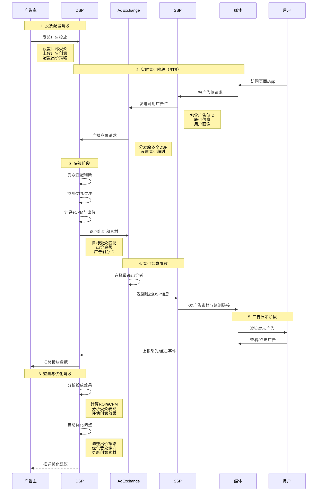

## 关键概念速查

### 核心平台与机制

- **eCPM（expected Cost Per Mille）**：千次展示期望收入，是 DSP、媒体和广告主共同关注的统一指标，通常由预测 CTR、CVR 以及出价策略共同决定。
- **DSP（Demand Side Platform）**：需求方平台，聚合广告主预算，负责匹配人群、预测效果并代表广告主竞价。
- **SSP（Supply Side Platform）**：供应方平台，服务媒体侧，负责管理广告位库存、底价和收益优化。
- **AdX（Ad Exchange）**：广告交易平台，连接 DSP 与 SSP，以标准化协议撮合竞价，是公开交易市场的核心基础设施。
- **RTB（Real-Time Bidding）**：实时竞价机制，从请求到出价通常在 100ms 以内完成，是程序化广告的默认交易模式。
- **DMP（Data Management Platform）**：数据管理平台，聚合第一方与第三方数据，完成用户分群、相似人群扩展，并为 DSP/SSP 输出人群标签。
- **CTR / CVR**：点击率与转化率，分别衡量广告吸引力与转化效果，是预测模型和投放优化的关键特征。
- **GD（Guaranteed Delivery）**：担保式交付，按合同约定的曝光量或周期投放，通常用于品牌广告的保量保质交付。
- **PMP（Private Marketplace）**：私有交易市场，在程序化协议下"包场"优质资源，常带固定的底价、白名单和更高的数据透明度。

### 常见计费模式

**直接计费模式**（媒体侧可直接统计）：

- **CPC（Cost Per Click）**：按点击付费，用户点击广告时计费，适合追求直接响应的效果广告，风险由广告主和媒体共担。
- **CPM（Cost Per Mille）**：按千次展示付费，每展示 1000 次收取固定费用，适合品牌曝光和知名度提升，媒体收益确定性高。
- **CPT（Cost Per Time）**：按时间付费，广告在指定位置展示固定时长，常见于开屏广告、首页焦点图等优质资源位。
- **CPD（Cost Per Day）**：按天付费，广告在特定位置展示一整天，适合预算固定、追求稳定曝光的品牌广告。

**效果计费模式**（需接入转化回流数据或使用平台落地页）：

- **CPA（Cost Per Action）**：按行为付费，用户完成注册、下载、添加购物车等行为时计费，需在落地页或 App 中埋点上报转化事件。
- **CPS（Cost Per Sale）**：按销售付费，用户完成购买时按销售额比例计费，常用于电商平台和联盟营销，需对接订单数据回流。
- **CPL（Cost Per Lead）**：按潜在客户付费，用户提交联系信息时计费，如小红书留资广告需开通聚光平台使用平台表单功能。
- **CPR（Cost Per Response）**：按反馈付费，用户提交表单、问卷或发起咨询时计费，常见于教育、金融等需要销售线索的行业。

## 原生广告与内容一致性

IAB（美国互动广告局）在 2014 年发布的《原生广告手册》中将原生广告定义为：与页面内容紧密关联、融入整体设计且与平台交互行为保持一致的广告形态，让用户自然地认为它本就是产品的一部分。

## 常见的广告投放类型

### 主流广告形态（占比 80% 以上）

- **信息流广告（Feed Ad）**：融入社交媒体或新闻 App 信息流的原生广告形式，通常采用图片或视频素材混排在用户生成内容中，降低商业感知。主要用于新客获取与品牌曝光，因用户意向性较低，转化率通常不如搜索广告。代表平台包括微信朋友圈、小红书、抖音等。
- **搜索广告（Search Ad）**：基于用户搜索关键词触发的广告形式，在搜索结果页顶部或底部展示，意向性极强，转化率高。适合直接追求 ROI 与销售转化的场景，是效果广告的经典模式。代表平台包括百度、Google、淘宝直通车等。
- **种草广告**：以用户分享、评测等形式植入产品推荐内容，依赖 KOC/KOL 的信任背书提升品牌心智。主要用于品牌认知与口碑传播，转化路径较长，需配合带货链接或优惠码追踪效果。代表平台包括小红书、B站等内容社区。

### 其他补充形态（联盟与长尾流量）

- **媒体广告（Banner/Video Ad）**：在视频、音频、图文内容前/中/后插入的广告，常见于 OTT、长视频平台或资讯站点，形式包括贴片、角标、暂停页等。
- **插页广告（Interstitial Ad）**：在用户操作间隙全屏展示的广告，常用于 App 启动、关卡切换或页面跳转时，具有较强的侵入性但曝光效果明显。
- **游戏广告（Rewarded Video / Playable Ad）**：在游戏场景中通过激励视频或试玩形式插入的广告，用户可通过观看或互动获得游戏内奖励，适合休闲游戏变现。

## 从访问到展示：一次广告请求的生命周期

1. **用户访问**：用户打开页面或启动 App，媒体端触发可售广告位的曝光机会。
2. **媒体组装请求**：媒体站点或 SDK 收集设备 ID、位置、内容上下文等信息，向 SSP/AdX 发起带 UID 的广告请求。
3. **SSP/AdX 竞价分发**：交易平台校验广告位策略（底价、封禁名单），并将请求广播给接入的多个 DSP，同步传递上下文、用户画像以及竞价截止时间。
4. **DSP 内部决策**：  
   - 查询 DMP 用户画像与广告主的投放策略是否匹配。  
   - 调用 CTR/CVR 模型预测效果，推导 eCPM。  
   - 根据预算消耗、频控、投放目标等策略计算最终出价。
5. **竞价回传与胜出**：所有 DSP 在严格的超时时间内返回出价，AdX 采用二价或一价模式决出胜者，并把胜出 DSP 的素材与监测链接下发给媒体。
6. **广告展示与上报**：媒体渲染素材给用户，触发曝光、点击、转化等监测上报，数据再回流 DMP 和 DSP，支撑下一轮模型训练与策略调优。

## DSP 广告投放完整流程

以下流程图展示了广告主通过 DSP 进行广告投放的完整生命周期，从投放配置到效果优化的闭环过程：

### 流程说明

1. **投放配置阶段**：广告主在 DSP 平台配置投放参数，包括目标受众画像、预算分配、出价策略和广告创意。

2. **实时竞价阶段**：当用户访问媒体时，SSP 将广告位信息发送到 Ad Exchange，由 AdX 同时向多个 DSP 发起竞价邀请。

3. **决策阶段**：DSP 快速判断该流量是否匹配投放策略，通过机器学习模型预测广告效果，并计算出价金额。

4. **竞价结算阶段**：Ad Exchange 选出出价最高且符合要求的 DSP，将其广告素材和监测代码传递给媒体。

5. **广告展示阶段**：媒体将广告渲染给用户，并实时上报曝光、点击等行为数据。

6. **监测与优化阶段**：DSP 持续收集投放数据，基于 ROI、eCPM 等指标自动优化出价和定向策略，形成投放闭环。

### 虚拟广告位的本质

值得注意的是，广告主购买的并非固定的物理广告位，而是基于**人群、时段、设备等维度组合的虚拟流量包**。DSP 通过程序化能力将这些离散的曝光机会打包成符合投放目标的"虚拟广告位"，这也是程序化广告区别于传统媒体采购的核心特征。

## 参考

- [ 系统设计 ｜ 一文了解现代广告系统的逻辑](https://mp.weixin.qq.com/s/JSZPPUg10aGAt12ZZ5kzeQ)